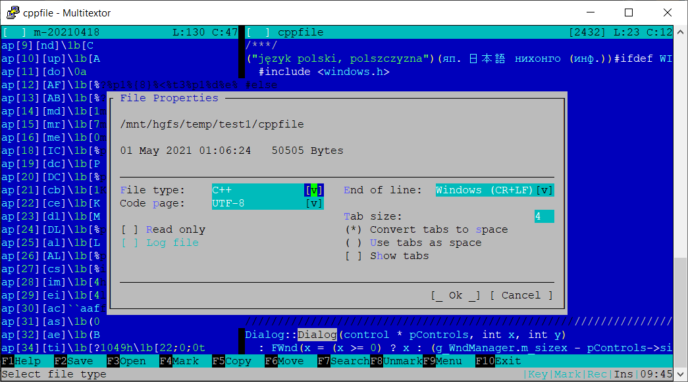

# Multitextor
 Cross platform console mode text editor.

This project is mostly recreated version of my old text editor.

[][license]

Linux/Windows build (Travis CI): [][travis]

[license]: https://github.com/vikonix/multitextor/blob/main/LICENSE
[travis]: https://travis-ci.org/vikonix/multitextor

## In progress:
- Editor 2.0.0 MVP (beta) version.
 
## Key features:
- Simple interface same in different environments (with menu and dialog)
- Mouse and keyboard cursor movement and selection
- Multi-window
- Split view mode with 2 panels
- Clear working with different text code pages
- Different select modes
- Big files editing over 4 GBytes (with small memory using)
- Deep Undo/Redo

Not implemented now (not MVP):
- Searching in on disk files
- Backup files
- Editor session saving/restoring
- Random access bookmarks
- Customizable interface and key commands
- Customizable syntax highlighting
- Build-in file comparing mode
 
Editor screenshot.
  

## Tested on:
 - Windows 10 - Microsoft Visual Studio Community 2019 / 2017
 - Windows 7 - Microsoft Visual Studio Community 2017
 - Linux Ubuntu 20.04 - gcc version 9.3.0
 - Armbian Focal OrangePI 4

For building it needs a compiler with C++ 0x17 full support.

Minimal requirement: gcc 8.0 or MSVS 2017

## Need to install packages in Linux:
 - sudo apt-get install -y libncurses5-dev
 - sudo apt-get install -y libgpm-dev
 - sudo apt-get install -y gpm (only for mouse supporting in console)
 
## How to build
 - Install CMake 3.15 or higher
 - Install g++ or clang or MSVC
 - Run CMake: ***cmake -B _build -S .***
 
    or ***cmakegen.bat***
    
 - Build editor
    - in Linux run: ***build.sh***
    - in Windows try to run: ***msbuild /p:Configuration=Release Multitextor.sln*** 
    - or open solution ***_build/Multitextor.sln*** with MSVC
    
 - Get editor in Linux ***_build/bin/multitextor*** or in Windows ***_build/bin/Debug|Release/multitextor.exe***
    
 