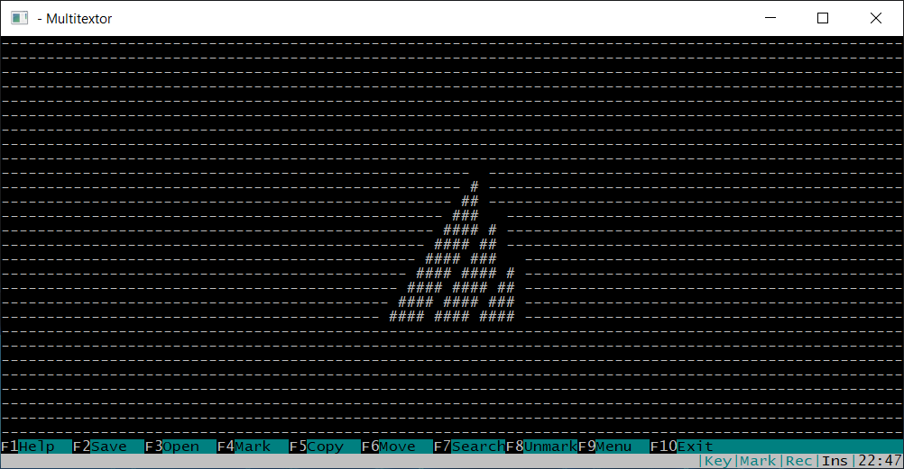
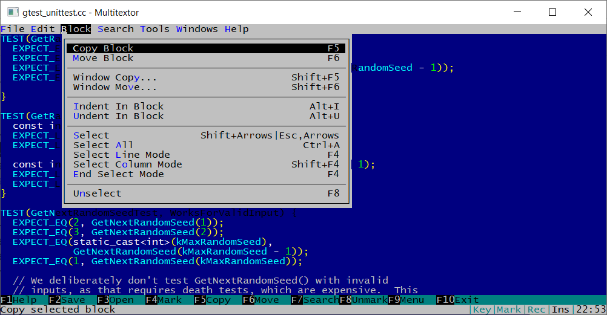
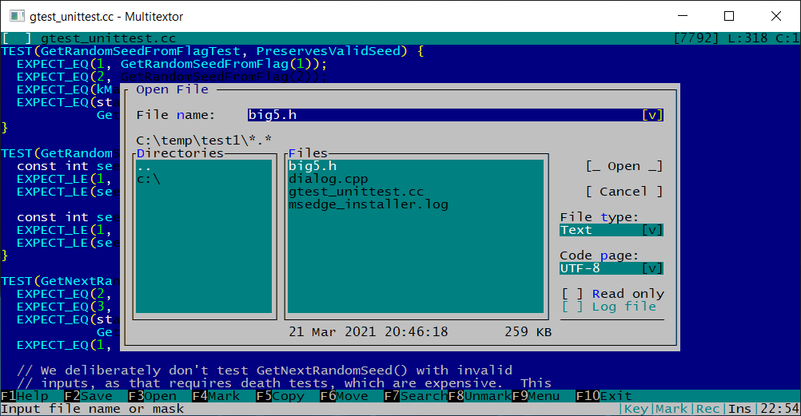
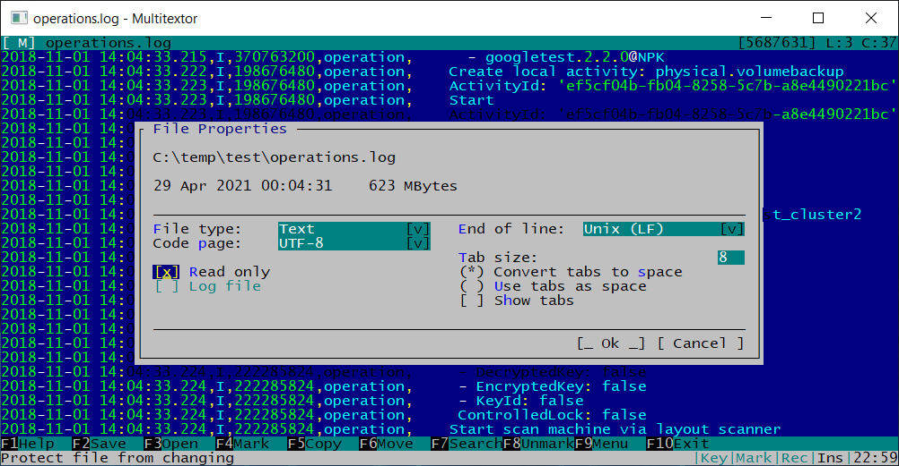
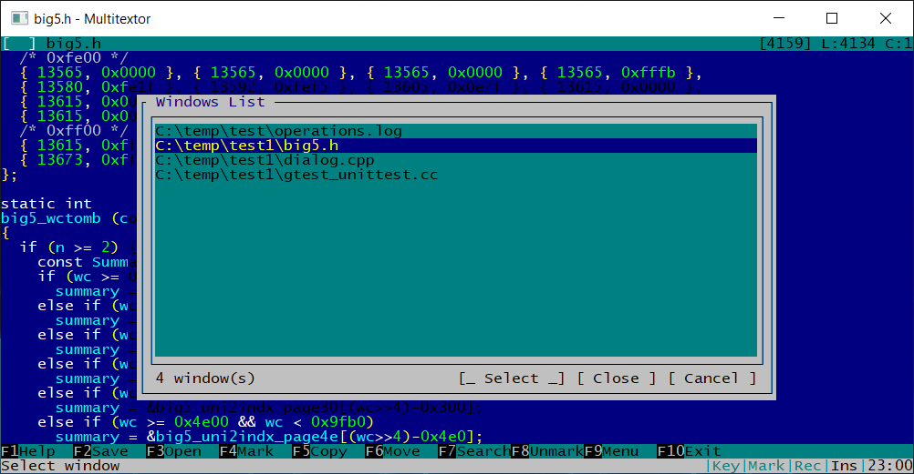

## Some editor screenshots.

Start screen screenshot.
  

Menu screenshot.
  

Open file dialog.
  

File properties dialog.
  

Two panels view mode.
  

Windows list dialog.
  

## Editor keyboard combination map to editor commands.

|Keys               |Commands|
|----               |--------|
|F1              	|~~APP_HELP~~|
|F2              	|APP_SAVE_ALL|
|Alt+S           	|APP_SAVE_ALL|
|Ctrl+Shift+S      	|APP_SAVE_ALL|
|F3              	|APP_DLG_OPEN|
|Ctrl+O            	|APP_DLG_OPEN|
|Shift+F5        	|APP_DLG_WND_COPY|
|Shift+F6        	|APP_DLG_WND_MOVE|
|Alt+F           	|APP_DLG_FINDFILE|
|Esc  F7         	|APP_DLG_FINDFILE|
|Esc  f          	|APP_DLG_FINDFILE|
|Esc  F          	|APP_DLG_FINDFILE|
|Ctrl+Shift+F     	|APP_DLG_FINDFILE|
|Alt+H           	|APP_DLG_REPLACEFILE|
|Esc  h          	|APP_DLG_REPLACEFILE|
|Esc  H          	|APP_DLG_REPLACEFILE|
|Ctrl+Shift+H      	|APP_DLG_REPLACEFILE|
|Alt+R           	|APP_DLG_REPLACEFILE|
|Esc  r          	|APP_DLG_REPLACEFILE|
|Esc  R          	|APP_DLG_REPLACEFILE|
|Ctrl+L          	|APP_DLG_FOUNDFILE|
|Alt+L           	|APP_DLG_FOUNDFILE|
|Ctrl+W          	|APP_DLG_WND_LIST|
|F9              	|APP_MENU|
|Esc  F1         	|APP_MENU|
|F10             	|APP_EXIT|
|Alt+X           	|APP_EXIT|
|Esc  x          	|APP_EXIT|
|Esc  X          	|APP_EXIT|
|Esc  0          	|Insert|
|Alt+/           	|APP_VIEW_SPLIT_MERGE|
|Alt++           	|APP_VIEW_SPLIT_VH|
|Alt+=           	|APP_VIEW_SPLIT_VH|
|Alt+-           	|APP_VIEW_SIZE|
|Esc  /          	|APP_VIEW_SPLIT_MERGE|
|Esc  =          	|APP_VIEW_SPLIT_VH|
|Esc  +          	|APP_VIEW_SPLIT_VH|
|Esc  -          	|APP_VIEW_SIZE|
|Alt+PageUp      	|APP_VIEW_CHANGE|
|Alt+PageDn      	|APP_VIEW_CHANGE|
|Esc  PageUp     	|APP_VIEW_CHANGE|
|Esc  PageDn     	|APP_VIEW_CHANGE|
|Esc  9          	|APP_VIEW_CHANGE|
|Esc  3          	|APP_VIEW_CHANGE|
|Ctrl+D          	|~~APP_DLG_DIFF~~|
|Ctrl+\          	|~~APP_DLG_BOOKMARK~~|
|Alt+\           	|~~APP_DLG_BOOKMARK~~|
|Alt+0           	|~~APP_BOOKMARK_0~~|
|Alt+1           	|~~APP_BOOKMARK_1~~|
|Alt+2           	|~~APP_BOOKMARK_2~~|
|Alt+3           	|~~APP_BOOKMARK_3~~|
|Alt+4           	|~~APP_BOOKMARK_4~~|
|Alt+5           	|~~APP_BOOKMARK_5~~|
|Alt+6           	|~~APP_BOOKMARK_6~~|
|Alt+7           	|~~APP_BOOKMARK_7~~|
|Alt+8           	|~~APP_BOOKMARK_8~~|
|Alt+9           	|~~APP_BOOKMARK_9~~|
|Ctrl+K          	|APP_RECORD_MACRO|
|Alt+K           	|APP_PLAY_MACRO|
|Ctrl+Q          	|~~APP_DLG_KEYGEN~~|
|F12             	|APP_REFRESH|
|KeyLeft         	|EDIT_MOVE_LEFT|
|KeyRight        	|EDIT_MOVE_RIGHT|
|KeyUp           	|EDIT_MOVE_UP|
|KeyDown         	|EDIT_MOVE_DOWN|
|MouseScrollUp   	|EDIT_MOVE_SCROLL3_UP|
|MouseScrollDown 	|EDIT_MOVE_SCROLL3_DOWN|
|PageUp          	|EDIT_MOVE_PAGE_UP|
|PageDn          	|EDIT_MOVE_PAGE_DOWN|
|Home            	|EDIT_MOVE_STR_BEGIN|
|End             	|EDIT_MOVE_STR_END|
|Ctrl+Home       	|EDIT_MOVE_FILE_BEGIN|
|Ctrl+End        	|EDIT_MOVE_FILE_END|
|Alt+Home        	|EDIT_MOVE_FILE_BEGIN|
|Alt+End         	|EDIT_MOVE_FILE_END|
|Esc  Home       	|EDIT_MOVE_FILE_BEGIN|
|Esc  End        	|EDIT_MOVE_FILE_END|
|Esc  7          	|EDIT_MOVE_FILE_BEGIN|
|Esc  1          	|EDIT_MOVE_FILE_END|
|Ctrl+KeyLeft    	|EDIT_MOVE_WORD_LEFT|
|Ctrl+KeyRight   	|EDIT_MOVE_WORD_RIGHT|
|Alt+,           	|EDIT_MOVE_WORD_LEFT|
|Alt+.           	|EDIT_MOVE_WORD_RIGHT|
|Alt+<           	|EDIT_MOVE_WORD_LEFT|
|Alt+>           	|EDIT_MOVE_WORD_RIGHT|
|Esc  ,          	|EDIT_MOVE_WORD_LEFT|
|Esc  .          	|EDIT_MOVE_WORD_RIGHT|
|Ctrl+]          	|EDIT_MOVE_BRACKET_MATCH|
|Ctrl+[          	|EDIT_MOVE_BRACKET_MATCH|
|Ctrl+T          	|EDIT_MOVE_CENTER|
|Alt+KeyUp       	|EDIT_MOVE_SCROLL_UP|
|Alt+KeyDown     	|EDIT_MOVE_SCROLL_DOWN|
|Alt+KeyLeft     	|EDIT_MOVE_SCROLL_LEFT|
|Alt+KeyRight    	|EDIT_MOVE_SCROLL_RIGHT|
|Delete          	|EDIT_DEL_CHAR|
|Esc  BackSpace  	|EDIT_DEL_CHAR|
|Ctrl+Y          	|EDIT_DEL_STR|
|Enter           	|EDIT_ENTER|
|Tab             	|EDIT_TAB|
|BackSpace       	|EDIT_BS|
|MouseLeft2      	|EDIT_SELECT_WORD|
|MouseLeft3      	|EDIT_SELECT_LINE|
|Ctrl+Space      	|EDIT_SELECT_WORD|
|Esc  KeyLeft    	|EDIT_SELECT_STREAM_BEGIN + EDIT_MOVE_LEFT|
|Esc  KeyRight   	|EDIT_SELECT_STREAM_BEGIN + EDIT_MOVE_RIGHT|
|Esc  KeyUp      	|EDIT_SELECT_STREAM_BEGIN + EDIT_MOVE_UP|
|Esc  KeyDown    	|EDIT_SELECT_STREAM_BEGIN + EDIT_MOVE_DOWN|
|Shift+KeyLeft   	|EDIT_SELECT_SHIFT_BEGIN + EDIT_MOVE_LEFT|
|Shift+KeyRight  	|EDIT_SELECT_SHIFT_BEGIN + EDIT_MOVE_RIGHT|
|Shift+KeyUp     	|EDIT_SELECT_SHIFT_BEGIN + EDIT_MOVE_UP|
|Shift+KeyDown   	|EDIT_SELECT_SHIFT_BEGIN + EDIT_MOVE_DOWN|
|Shift+Home      	|EDIT_SELECT_SHIFT_BEGIN + EDIT_MOVE_STR_BEGIN|
|Shift+End       	|EDIT_SELECT_SHIFT_BEGIN + EDIT_MOVE_STR_END|
|Shift+PageUp    	|EDIT_SELECT_SHIFT_BEGIN + EDIT_MOVE_PAGE_UP|
|Shift+PageDn    	|EDIT_SELECT_SHIFT_BEGIN + EDIT_MOVE_PAGE_DOWN|
|F4              	|EDIT_SELECT_LINES_BEGIN|
|Shift+F4        	|EDIT_SELECT_COLUMN_BEGIN|
|F8              	|EDIT_SELECT_UNSELECT|
|F4              	|EDIT_SELECT_END|
|Esc  Esc        	|EDIT_SELECT_END|
|ShiftRelease    	|EDIT_SELECT_SHIFT_END|
|Ctrl+A          	|EDIT_SELECT_ALL|
|Ctrl+B          	|EDIT_SELECT_ALL_FOUND|
|F5              	|EDIT_BLOCK_COPY|
|F6              	|EDIT_BLOCK_MOVE|
|Alt+Y           	|EDIT_BLOCK_DEL|
|Ctrl+X          	|EDIT_CB_CUT|
|Ctrl+C          	|EDIT_CB_COPY|
|Ctrl+V          	|EDIT_CB_PASTE|
|Shift+Delete    	|EDIT_CB_CUT|
|Ctrl+Insert     	|EDIT_CB_COPY|
|Shift+Insert    	|EDIT_CB_PASTE|
|Alt+I           	|EDIT_BLOCK_INDENT|
|Alt+U           	|EDIT_BLOCK_UNINDENT|
|Esc  i          	|EDIT_BLOCK_INDENT|
|Esc  I          	|EDIT_BLOCK_INDENT|
|Esc  u          	|EDIT_BLOCK_UNINDENT|
|Esc  U          	|EDIT_BLOCK_UNINDENT|
|Ctrl+Z          	|EDIT_UNDO|
|Alt+BackSpace   	|EDIT_UNDO|
|Alt+Z           	|EDIT_REDO|
|Esc  z          	|EDIT_REDO|
|Esc  Z          	|EDIT_REDO|
|Ctrl+G          	|EDIT_DLG_GOTO|
|Ctrl+F          	|EDIT_DLG_FIND|
|F7              	|EDIT_DLG_FIND|
|Ctrl+R          	|EDIT_DLG_REPLACE|
|Ctrl+H          	|EDIT_DLG_REPLACE|
|Ctrl+F7         	|EDIT_CTRL_FIND|
|Shift+F7        	|EDIT_CTRL_REPEAT|
|Ctrl+P          	|EDIT_CTRL_FINDUP|
|Ctrl+N          	|EDIT_CTRL_FINDDN|
|Alt+P           	|EDIT_CTRL_FINDUPWORD|
|Alt+N           	|EDIT_CTRL_FINDDNWORD|
|Ctrl+S          	|EDIT_CTRL_SAVE|
|Esc  F2         	|EDIT_CTRL_SAVE|
|Shift+F2        	|EDIT_CTRL_SAVEAS|
|Shift+F3        	|EDIT_CTRL_RELOAD|
|Esc  F3         	|EDIT_CTRL_RELOAD|
|Shift+F10       	|EDIT_CTRL_CLOSE|
|Esc  F10        	|EDIT_CTRL_CLOSE|
|Alt+M           	|EDIT_POPUP_MENU|
|Esc  m          	|EDIT_POPUP_MENU|
|Esc  M          	|EDIT_POPUP_MENU|
|Ctrl+E          	|EDIT_DLG_PROPERTIES|
|Ctrl+J          	|~~EDIT_DLG_FUNC_LIST~~|
|F11             	|EDIT_CTRL_REFRESH|
